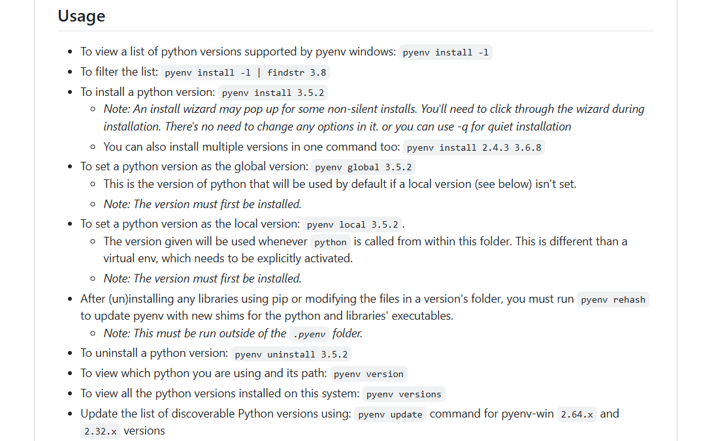

# Estudos 

## Gerenciamento de pacotes

### Pip

Tutorial instalando pip para gerenciamento de pacotes pyhton: [installing-packages](https://packaging.python.org/pt_BR/latest/tutorials/installing-packages/)

**Comandos básicos:**

* Certifique-se que pip, setuptools e wheel estejam atualizados:

    ```
    py -m pip install --upgrade pip setuptools wheel
    ```

* Listar todos os pacotes instalados
        
    ```
    pip list --outdated
    ```

#### Atualizando dependências globais do PIP:

[https://www.activestate.com/resources/quick-reads/how-to-update-all-python-packages/](https://www.activestate.com/resources/quick-reads/how-to-update-all-python-packages/)

**Powershell:**

    pip freeze | %{$_.split('==')[0]} | %{pip install --upgrade $_}
    
**Bash:**

    pip3 list --outdated --format=freeze | grep -v '^\-e' | cut -d = -f 1 | xargs -n1 pip3 install -U

### Pipenv

Tutorial para instalação do pipenv: [Tutorial de instalação](https://packaging.python.org/pt_BR/latest/tutorials/managing-dependencies/)

Local onde os ambientes virtual são criados: C:\Users\{CURRENT_USER}\.virtualenvs

Links uteis:

1) [pipenv](https://pipenv.pypa.io/en/latest/)

2) [advanced](https://docs.pipenv.org/advanced/)

#### ☤ Configuração com variáveis de ambiente¶

`PIPENV_VENV_IN_PROJECT` Se definido, use `.venv` no seu diretório de projeto em vez do gerenciador global de virtualenv pew.


**Comandos básicos:**

* pipenv para listar comandos:
        
    ```
    pipenv
    ```

*  criar ambiente virtual

    ```
    pipenv --python 3.11.1 (3.11.1<VERSION_PYTON>)
    ``` 

* remove a virtualenv created by "pipenv run"
  
    ```
    pipenv --rm
    ```

* Listar local onde o ambiente virtual está

    ```
    pipenv --venv
    ```

## Mypy:

### Documentação:
[https://mypy.readthedocs.io/en/stable/getting_started.html](https://mypy.readthedocs.io/en/stable/getting_started.html)

### Instalação:
     pipenv install mypy --save-dev

### Comandos:
    
#### Executar análise em um arquivo:
    mypy {FILE_NAME}.py


## Pipx
[https://pipx.pypa.io/stable/](https://pipx.pypa.io/stable/)

Para gerenciar executaveis python. <br>
Instalando pipx no python global: <br>
`pip install pipx` <br>
`pipx ensurepath`

Apos instaladado o `pipx`, no windows é necessário executar o comando: 
`pipx ensurepath` para adicionar os executaveis do pipx ao ambiente para ser executado
pela linha de comando.

### Comandos:

`pipx list` -> Lista pacotes instalados

`pipx install {PACKAGE_NAME}` -> Instala pacote

`pipx uninstall {PACKAGE_NAME}` -> Remove pacote

`pipx upgrade {PACKAGE_NAME}` -> Atualiza pacote

# Poetry

> Local onde os ambientes virtuais criados para o `poetry` <br>
> estão: `%USERPROFILE%/AppData\Local\pypoetry\Cache\virtualenvs` <br>


### Comandos:

`poetry env info --path` -> Exibe path de onde o `env`encontra-se 

`poetry env list` -> Lista todos os enviroments gerenciados

`poetry env remove {{POETRY_ENV_NAME}}` -> Remove enviroment selecionado

`poetry env use` ->  Activates or creates a new virtualenv for the current project.

`poetry new {{PROJECT_NAME}}` -> Cria novo projeto com gerenciador poetry

`poetry init` -> Inicializa projeto com gerenciador poetry


## Gerenciador de múltiplas versões python
[https://github.com/pyenv-win/pyenv-win](https://github.com/pyenv-win/pyenv-win)



